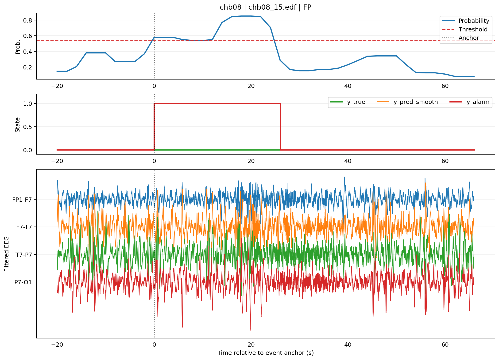

# Seizure detection error analysis

The reported refinement study investigated delayed detections in `chb04` and false alarms in `chb08`. It covers **10 subjects, 54 seizures and 564.56 h**, compared with 55 seizures and 580.57 h in the main study. Coverage differs for `chb04`, `chb06` and `chb09`; the saved summaries do not establish the exact cause. Compare refinements only with this study's own baseline.

## Findings and decisions

| Variant | Mean subject sensitivity | Median subject FAR/h | Mean subject delay (s) | Decision |
| --- | ---: | ---: | ---: | --- |
| Study baseline | 0.9778 | 0.3907 | 9.96 | Comparison baseline |
| Proxy-feature augmentation | 0.9778 | 0.2575 | 9.42 | Accepted within this study |
| Artifact-aware suppression | 0.7873 | 0.1854 | 8.45 | Rejected: sensitivity loss |
| Smaller hybrid proxy set | 0.9528 | 0.2551 | 9.63 | Rejected: missed chb04 event |
| Hybrid plus amplitude count | 0.9667 | 0.2810 | 11.07 | Rejected: later chb04 alarm |
| Delay-first threshold, 2-epoch duration | 0.9778 | 1.2423 | 6.03 | Rejected: false alarm increase |

Values are preserved from Table 12 of the [academic report](../../docs/EE6019_Final_Report_PUBLIC_REDACTED.pdf) in [refinement_comparison.csv](refinement_comparison.csv). The report's “macro FAR” column computes the **median**, not mean, of subject FARs. Delay is the mean of subject mean detected-event delays.

Proxy augmentation adds amplitude, line-length and frequency-ratio features to the temporal representation. It was the accepted refinement in its comparison; it was not substituted into the main headline result. Smaller feature sets and earlier thresholds failed the acceptance criteria: no new zero-sensitivity patient, no more than 0.02 macro sensitivity loss, lower median FAR, lower chb08 FAR and no worsening of chb04 delay. The final timing comparison therefore retained its baseline.

Two chb04 examples have delays of **104 s and 20 s**. Among 15 reviewed chb08 false alarms, **14 were classified as uncertain** and one as a transition state. These are heuristic descriptions, not clinical adjudications; they do not justify claiming that artifacts explain most false alarms.

## Evidence

- [Patient comparison](patient_comparison.csv), [timing comparison](timing_comparison.csv) and [acceptance checks](acceptance_checks.csv) preserve the final timing experiment, including negative findings.
- [Delayed events](delayed_events.csv), [false-alarm events](false_alarm_events.csv) and [case index](cases.csv) identify representative recordings and figures.
- [False-alarm features](false_alarm_features.csv), [reason counts](false_alarm_reasons.csv), [event feature summary](event_feature_summary.csv) and [effect sizes](event_feature_effects.csv) support descriptive error inspection.

`_s` denotes seconds; `FAR_per_Hour` denotes events per evaluated hour. `FP_events` in these exported case tables counts wholly unmatched predicted events. It can differ from FAR multiplied by hours, because the study scorer counted non-seizure alarm fragments, including fragments of alarms overlapping seizures. Those distinct definitions are preserved, not silently equated.

These are saved experimental outputs, not a fresh run. The maintained package implements the main RF pipeline and case inspection, not the full proxy-variant experiment suite. Repeated inspection of the same held-out cases influenced variant design, so acceptance here does not establish independent generalization. The corrected evaluator also changes recording-boundary handling and validation smoothing; fresh raw-data experiments are needed before transferring these measurements to that implementation.
